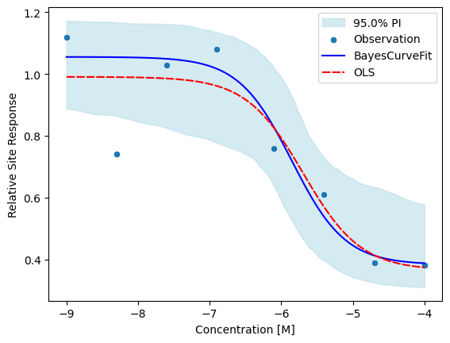
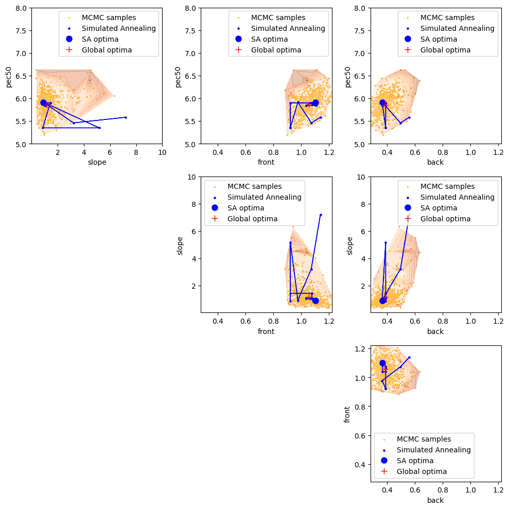
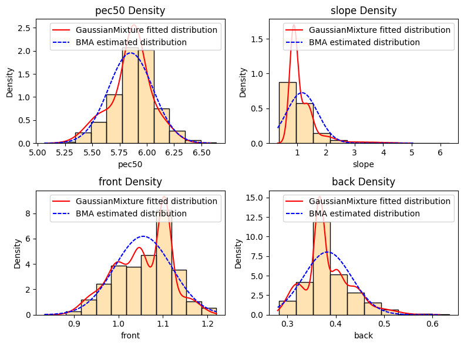

# BayesCurveFit

BayesCurveFit: A Bayesian Inference Workflow for Enhanced Curve Fitting in Undersampled Drug Discovery Data

## Overview
BayesCurveFit is a Python package designed to apply Bayesian inference for curve fitting, especially tailored for undersampled and outlier-contaminated data. It supports advanced model fitting and uncertainty estimation for biological data, such as dose-response curves in drug discovery.

This example demonstrates how to use the BayesCurveFit package to perform a 4-parameter log-logistic model fit using Bayesian inference.

# BayesCurveFit General workflow


```python
import numpy as np
from bayescurvefit.execution import BayesFitModel

# User define equation and data input

def log_logistic_4p(x: np.ndarray, pec50: float, slope: float, front: float, back: float) -> np.ndarray:
    with np.errstate(over="ignore", under="ignore", invalid="ignore"):
        y = (front - back) / (1 + 10 ** (slope * (x + pec50))) + back
        return y

x_data = np.array([-9.0, -8.3, -7.6, -6.9, -6.1, -5.4, -4.7, -4.0])
y_data = np.array([1.12, 0.74, 1.03, 1.08, 0.76, 0.61, 0.39, 0.38])
params_range = [(5, 8), (0.01, 10), (0.28, 1.22), (0.28, 1.22)] # This range represents your best estimation of where the parameters likely fall
param_names = ["pec50", "slope", "front", "back"]

# Executing Bayesian workflow
run = BayesFitModel(
    x_data=x_data,
    y_data=y_data,
    fit_function=log_logistic_4p,
    params_range=params_range,
    param_names=param_names,
)
```


```python
# Retrive results
run.get_result()
```


    fit_pec50               5.85208
    fit_slope              1.162382
    fit_front              1.055521
    fit_back               0.382905
    std_pec50              0.203935
    std_slope              0.549992
    std_front              0.064507
    std_back               0.049695
    est_std                0.089587
    null_mean              0.762365
    rmse                   0.121321
    pep                    0.067176
    convergence_warning       False
    dtype: object


```python
# Visualizing fitting results for individual runs
import matplotlib.pyplot as plt
f,ax = plt.subplots()
run.analysis.plot_fitted_curve(ax=ax)
ax.set_xlabel("Concentration [M]")
ax.set_ylabel("Relative Site Response")
```


    Text(0, 0.5, 'Relative Site Response')


    

    


```python
# SA and MCMC sampling diagnoses 
run.analysis.plot_pairwise_comparison(figsize=(10, 10))
```


    

    


```python
# Error distribution of fitted parameters
run.analysis.plot_param_dist()
```


    

    


# Other dose-response like equations can be processed similarly


```python
def michaelis_menten_func(x, vamx, km):
    return (vamx * x) / (km + x)


x_data = np.array(
    [
        0.5,
        2.0,
        4.0,
        5.0,
        6.0,
        8.0,
        10.0,
    ]
)
y_data = np.array(
    [
        0.3,
        0.6,
        0.8,
        np.nan,
        1.2,
        0.85,
        0.9,
    ]
)

params_range = [(0.01, 5), (0, 5)]
param_names = ["vmax", "km"]

run_mm = BayesFitModel(
    x_data=x_data,
    y_data=y_data,
    fit_function=michaelis_menten_func,
    params_range=params_range,
    param_names=param_names,
)
```


```python
run_mm.get_result()
```


```python
f,ax = plt.subplots()
run_mm.analysis.plot_fitted_curve(ax=ax)
ax.set_xlabel("Substrate Concentration [S] (M)")
ax.set_ylabel("Relative Response (V/V_max)")

```
