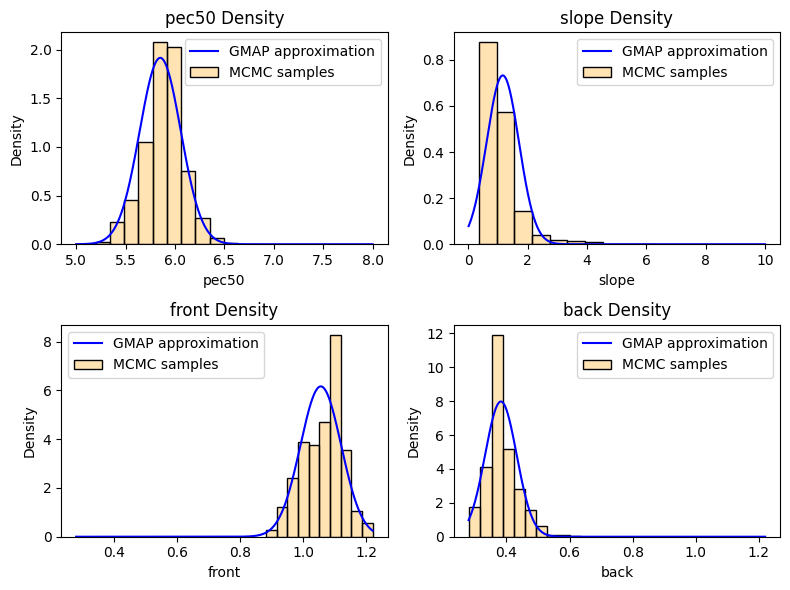
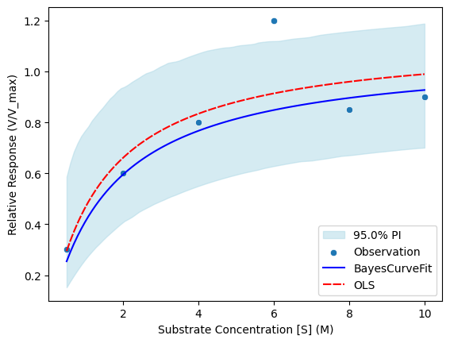

# BayesCurveFit

BayesCurveFit: Enhancing Curve Fitting in Drug Discovery Data Using Bayesian Inference

## Overview
BayesCurveFit is a Python package designed to apply Bayesian inference for curve fitting, especially tailored for undersampled and outlier-contaminated data. It supports advanced model fitting and uncertainty estimation for biological data, such as dose-response curves in drug discovery.

## Installation Guide

To install the project and its dependencies, run the following command:

```bash
make install

```

# BayesCurveFit General workflow

### Define the Curve Fitting Function and Input Data
In this example, we use the log-logistic 4-parameter model.

```python
import numpy as np
from bayescurvefit.execution import BayesFitModel

# User define equation and data input

def log_logistic_4p(x: np.ndarray, pec50: float, slope: float, front: float, back: float) -> np.ndarray:
    with np.errstate(over="ignore", under="ignore", invalid="ignore"):
        y = (front - back) / (1 + 10 ** (slope * (x + pec50))) + back
        return y

x_data = np.array([-9.0, -8.3, -7.6, -6.9, -6.1, -5.4, -4.7, -4.0])
y_data = np.array([1.12, 0.74, 1.03, 1.08, 0.76, 0.61, 0.39, 0.38])
params_range = [(5, 8), (0.01, 10), (0.28, 1.22), (0.28, 1.22)] # This range represents your best estimation of where the parameters likely fall
param_names = ["pec50", "slope", "front", "back"]

# Executing Bayesian workflow
run = BayesFitModel(
    x_data=x_data,
    y_data=y_data,
    fit_function=log_logistic_4p,
    params_range=params_range,
    param_names=param_names,
)
```
### Retrieve the Fitting Results
After running the model, you can retrieve the results using the get_result() method:

```python
# Retrive results
run.get_result()
```


    fit_pec50               5.85208
    fit_slope              1.162382
    fit_front              1.055521
    fit_back               0.382905
    std_pec50              0.203935
    std_slope              0.549992
    std_front              0.064507
    std_back               0.049695
    est_std                0.089587
    null_mean              0.762365
    rmse                   0.121321
    pep                    0.067176
    convergence_warning       False
    dtype: object


### Visualize the Fitting Results
You can visualize the fitted curve with the following code:
```python
# Visualizing fitting results for individual runs
import matplotlib.pyplot as plt
f,ax = plt.subplots()
run.analysis.plot_fitted_curve(ax=ax)
ax.set_xlabel("Concentration [M]")
ax.set_ylabel("Relative Site Response")
```


    Text(0, 0.5, 'Relative Site Response')


    

    

### Perform Sampling Diagnoses
You can also visualize pairwise comparisons for your fitted parameters with the following:

```python
# SA and MCMC sampling diagnoses 
run.analysis.plot_pairwise_comparison(figsize=(10, 10))
```


    

    

### Visualize the Error Distribution of Fitted Parameters
To view the distribution of the fitted parameters, use the following:

```python
# Error distribution of fitted parameters
run.analysis.plot_param_dist()
```


    

    


# Other Dose-Response Equations
You can use BayesCurveFit for other common dose-response equations, such as the Michaelis-Menten model. Below is an example using the Michaelis-Menten equation:


```python
def michaelis_menten_func(x, vamx, km):
    return (vamx * x) / (km + x)


x_data = np.array(
    [
        0.5,
        2.0,
        4.0,
        5.0,
        6.0,
        8.0,
        10.0,
    ]
)
y_data = np.array(
    [
        0.3,
        0.6,
        0.8,
        np.nan,
        1.2,
        0.85,
        0.9,
    ]
)

params_range = [(0.01, 5), (0, 5)]
param_names = ["vmax", "km"]

run_mm = BayesFitModel(
    x_data=x_data,
    y_data=y_data,
    fit_function=michaelis_menten_func,
    params_range=params_range,
    param_names=param_names,
)
```


```python
run_mm.get_result()
```


```python
f,ax = plt.subplots()
run_mm.analysis.plot_fitted_curve(ax=ax)
ax.set_xlabel("Substrate Concentration [S] (M)")
ax.set_ylabel("Relative Response (V/V_max)")

```


# Examples on how to run parallel execution 
BayesCurveFit can be easily set up for parallel execution for batch processing and pipeline integration. Here, we provide an example of how to enable parallel execution to speed up the fitting process.


```python
from joblib import Parallel, delayed
from tqdm import tqdm
import pandas as pd
from bayescurvefit.simulation import Simulation
from bayescurvefit.distribution import GaussianMixturePDF
```


```python
def run_bayescurvefit(df_input, x_data, output_csv, params_range, param_names = None):
    def process_sample(sample):
        y_data = df_input.loc[sample].values
        bayesfit_run = BayesFitModel(
            x_data=x_data,
            y_data=y_data,
            fit_function=michaelis_menten_func,
            params_range=params_range,
            param_names=param_names,
            run_mcmc=True,
        )
        return sample, bayesfit_run.get_result()

    samples = df_input.index.tolist()
    results = Parallel(n_jobs=-1)(
        delayed(process_sample)(sample) for sample in tqdm(samples)
    )
    dict_result = {sample: res for sample, res in results}
    df_output = pd.DataFrame(dict_result).T
    df_output.to_csv(output_csv)
    return df_output
```


```python
# Generate simulation dataset
sample_size = 6 # Number of observations
params_bounds = [(1, 1.2), [0.5, 1]] # Bounds for fitting parameters in simulation data
pdf_params = [0.1, 0.3, 0.1] # PDF parameters [scale1, scale2, mix_frac of second Gaussian]

x_sample = np.linspace(0.5, 10, sample_size)
sim = Simulation(fit_function=michaelis_menten_func,
                X=x_sample,
                pdf_function=GaussianMixturePDF(pdf_params=pdf_params),
                sim_params_bounds=params_bounds,
                n_samples=10,
                n_replicates=1)
```


```python
params_range = [(0.01, 5), (0, 5)] #The range of fitting parameters we estimated
param_names = ["vmax", "km"] #optional
df_output = run_bayescurvefit(df_input = sim.df_sim_data_w_error, x_data=sim.X, output_csv="test_output.csv", params_range= params_range, param_names = param_names)
```

    100%|████████████████████████████████████████████████████████████████████████████████████████████████████████████████████████████████████████████████████████████████████████████████| 10/10 [00:00<00:00, 3182.57it/s]


```python
df_output
```


<div>
<style scoped>
    .dataframe tbody tr th:only-of-type {
        vertical-align: middle;
    }

    .dataframe tbody tr th {
        vertical-align: top;
    }

    .dataframe thead th {
        text-align: right;
    }
</style>
<table border="1" class="dataframe">
  <thead>
    <tr style="text-align: right;">
      <th></th>
      <th>fit_vmax</th>
      <th>fit_km</th>
      <th>std_vmax</th>
      <th>std_km</th>
      <th>est_std</th>
      <th>null_mean</th>
      <th>rmse</th>
      <th>pep</th>
      <th>convergence_warning</th>
    </tr>
  </thead>
  <tbody>
    <tr>
      <th>m001</th>
      <td>1.045118</td>
      <td>0.524566</td>
      <td>0.062925</td>
      <td>0.258185</td>
      <td>0.085183</td>
      <td>0.882292</td>
      <td>0.088229</td>
      <td>0.073803</td>
      <td>False</td>
    </tr>
    <tr>
      <th>m002</th>
      <td>1.071195</td>
      <td>0.443714</td>
      <td>0.045651</td>
      <td>0.138288</td>
      <td>0.064156</td>
      <td>0.920486</td>
      <td>0.065077</td>
      <td>0.019197</td>
      <td>False</td>
    </tr>
    <tr>
      <th>m003</th>
      <td>0.984297</td>
      <td>0.40824</td>
      <td>0.025424</td>
      <td>0.078492</td>
      <td>0.039929</td>
      <td>0.851498</td>
      <td>0.039976</td>
      <td>0.001648</td>
      <td>False</td>
    </tr>
    <tr>
      <th>m004</th>
      <td>1.209595</td>
      <td>0.894308</td>
      <td>0.124583</td>
      <td>0.564617</td>
      <td>0.11161</td>
      <td>0.954443</td>
      <td>0.121742</td>
      <td>0.142142</td>
      <td>False</td>
    </tr>
    <tr>
      <th>m005</th>
      <td>1.105424</td>
      <td>0.83214</td>
      <td>0.079353</td>
      <td>0.301414</td>
      <td>0.086942</td>
      <td>0.864965</td>
      <td>0.088763</td>
      <td>0.016674</td>
      <td>False</td>
    </tr>
    <tr>
      <th>m006</th>
      <td>1.201407</td>
      <td>1.784976</td>
      <td>0.181883</td>
      <td>1.154269</td>
      <td>0.138952</td>
      <td>0.902685</td>
      <td>0.257211</td>
      <td>0.578311</td>
      <td>False</td>
    </tr>
    <tr>
      <th>m007</th>
      <td>1.028513</td>
      <td>1.422141</td>
      <td>0.261195</td>
      <td>1.132837</td>
      <td>0.196145</td>
      <td>0.666048</td>
      <td>0.322277</td>
      <td>0.896298</td>
      <td>False</td>
    </tr>
    <tr>
      <th>m008</th>
      <td>1.582351</td>
      <td>2.610932</td>
      <td>0.262687</td>
      <td>1.146798</td>
      <td>0.132637</td>
      <td>0.960053</td>
      <td>0.166416</td>
      <td>0.169033</td>
      <td>False</td>
    </tr>
    <tr>
      <th>m009</th>
      <td>1.235818</td>
      <td>1.616752</td>
      <td>0.090134</td>
      <td>0.457746</td>
      <td>0.063407</td>
      <td>0.845249</td>
      <td>0.064784</td>
      <td>0.002245</td>
      <td>False</td>
    </tr>
    <tr>
      <th>m010</th>
      <td>1.118741</td>
      <td>0.434675</td>
      <td>0.033465</td>
      <td>0.096011</td>
      <td>0.050537</td>
      <td>0.962909</td>
      <td>0.051087</td>
      <td>0.003034</td>
      <td>False</td>
    </tr>
  </tbody>
</table>
</div>
